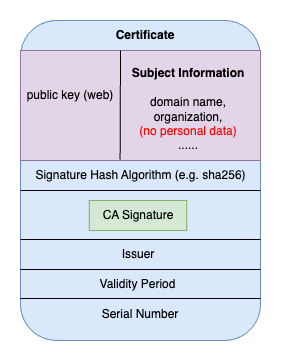
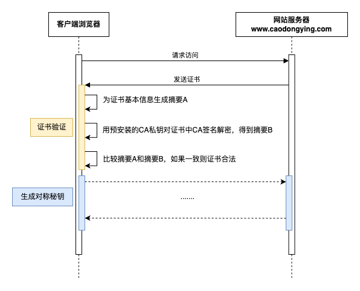

当你浏览网页的时候，你或许会留意到大部分网页的地址都以https开头。而当你访问那些以http（没有s）作为前缀的网站的时候，诸如Chrome这样的浏览器会提示你这是“不安全的连接”。你也许会感到好奇：

为什么连接会有安全和不安全之分呢？什么是https？为什么以https://开头的网站要比以http://开头的网站安全呢？浏览那些http网站存在哪些安全隐患？我该如何将我的网站由http“升级”为https呢？

HTTPS协议的全称是HyperText Transfer Protocol Secure，超文本传输协议安全。HTTPS协议是传输层HTTP协议的安全版本，因为其在HTTP协议的基础上添加了TLS/SSL加密层。与https相关的概念和话题有很多，你也许听过以下这些词：对称加密，非对称加密，CA(Certificate Authority)，证书验证，申请证书，公钥私钥......本文将由浅入深、抽丝剥茧地为你讲解https协议。

# 场景描述
假设你作为client（用户），想要访问一个网站，并且需要发送一些你不想被别人知道的数据，比如你的出生日期、银行卡账号等。为了表述方便，我们假设要访问的网站叫做www.caodongying.com。如果www.caodongying.com采用的是http协议，那么你在浏览网页、在某一刻提交自己信息的时候，数据是以明文的方式被传输的。也就是说如果黑客劫持了你和www.caodongying.com之间的连接，那么他就可以直接看到你所发送的消息，也可以看到www.caodongying.com返回给你的数据。

这会带来什么问题呢？有三点：
1. 信息泄露（窃听风险）。你向www.caodongying.com提交了自己的生日和银行卡账号，但是黑客劫持了连接并且知道了这些信息。
2. 数据篡改（篡改风险）。你访问www.caodongying.com时是想纯粹地阅读一些博客，但是黑客劫持了www.caodongying.com返回给你的博客界面，并且修改了脚本，在里面插入了广告。如此一来，你的阅读体验就大大下降。
3. 身份冒充。黑客可以冒充www.caodongying.com，你希望阅读一篇关于https的技术博客，但是黑客在冒充了这个网站后，返回给你一些其他消极的内容。

而如果www.caodongying.com采用https协议来传输数据，你的信息就会经过加密然后被传输。假设你原本的数据是”我的银行卡账号是12431"，加密后的结果就是"hjw#7428"，即使黑客劫持了你的连接也只能看到一串意义不明的加密码，无法知道真正的内容是什么。至于https是如何防止网站服务器返回的内容被篡改、防止网站本身被冒充的，我们将在下文继续介绍。

# 需求分析
现在我们知道了使用http协议进行数据传输会带来的问题，那么我们就可以知道作为解决方案的https协议身负的重任。我们从软件需求的角度来罗列一下https协议应该实现哪些需求：

1. 数据在传输前要经过加密
2. 网站不可以被冒充
3. 数据在传输过程中不可以被更改

# HTTPS协议内容
在https协议下，网站配置和用户访问网站的过程遵循如下流程：
1. 网站向CA申请证书，并在获取证书后将证书保存在网站服务器（server）中。CA可以保证客户端浏览器（client）收到的公钥的确是其要访问的网页发送的，也就是说，“我想访问百度界面，并且我收到的公钥的确是百度发的”。（这里是第一次非对称加密，CA利用私钥进行签名）
2. 客户端浏览器请求访问网站
3. 网站将自己的证书（包含网站公钥）发送给浏览器
4. 浏览器验证证书是否合法（这里依然是第一次非对称加密，浏览器利用本地根证书中保存的CA的公钥，对证书进行解密）
5. 如果证书合法，浏览器和网站交换用于之后对称加密消息的秘钥（旧的方法是用RSA算法，利用网站的公钥对浏览器生成的秘钥进行加密；现在采纳的办法是浏览器和网站双方利用ECDHE算法交换密钥。）
6. 浏览器和网站利用这个秘钥进行加密传输（对称加密，提高速率）

如果将上述步骤进行概括，那么https协议可以分为三个步骤：
1. 网站向CA请求证书
2. 客户端和网站服务器进行tls/ssl握手（第2-5步）
3. 客户端和网站利用对称加密进行数据传输

让我们来看一看这三个步骤的具体过程。

## 网站向CA请求证书

网站www.caodongying.com向CA申请证书。这是整个https协议成立的第一步。只有网站已经从正规的CA那里获取到了证书，客户端才可以安全地访问网站。从下面这张图，我们可以直观地显示网站向证书颁发机构CA请求数字证书、CA向网站颁发证书的过程。

在这个过程中，有几个值得注意的点：
- 为什么需要摘要呢？其实如果直接对证书明文进行签名，理论上来说也是可以的。但是非对称加密很复杂，耗时间，对明文进行摘要运算后可以缩减需要加密的内容长度，提高加密解密的效率。
- 证书签名请求（CSR）摘要的生成是由证书颁发机构完成的，而不是网站服务器本身。这个摘要会在被CA签名后，作为证书的一部分被发送给服务器。那么使用CA私钥签名的摘要有什么用呢？答案就是浏览器可以使用这个加要来确认自己收到的网页的公钥是否是真的。所谓摘要（digest），其实就是运用诸如SHA256一类的哈希算法，把内容很长的CSR转化成一个固定长度的字符串。一旦原始内容发生改变，经过SHA256编码后得到的内容也一定发生改变。并且，SHA256算法是不可逆的，没有办法从算法编码的结果推算原始内容。
- 你可能会想，为什么需要对摘要签名呢？首先我们知道，在非对称加密中，“用公钥加密，只能用私钥解密”，“用私钥签名，只能用公钥解密”。这里要注意，当我们谈及“私钥加密“的时候，实际上是利用私钥进行签名（signature）。如果在生成摘要后不对齐进行任何”加密“，摘要就会以明文形式出现在证书中并在网络上”裸奔“。黑客如果截取到这不安全的证书，大可以对证书内的公钥进行修改后，重新为假证书生成摘要。这样，客户端浏览器在接收到证书的时候，即使可以对主体内容和公钥再次生成摘要，也无法验证证书是否合法。（如果看得一头雾水，没关系，等之后看到客户端浏览器是如何验证证书的时候你就懂了）。所以，概括来讲，为CSR生成摘要，是为了防止证书被黑客篡改，尤其是其中的网站公钥。
- CA对证书进行私钥签名，那么公钥保存在哪里呢？不要着急，后文会讲，这里可以提前告诉你，CA的公钥是预安装在操作系统或浏览器中的，所以，要购买正版软件系统啊。
- 网站向CA发送的CSR中会包含诸如邮件、电话号码之类的隐私信息。而在CA办法的证书中，这些信息并不包含在内。

## tls/ssl握手
为了了解tls/ssl握手的具体过程，最直观的办法当然是用Wireshark抓包看一下。但对于不清楚握手的基本流程的人来说，直接抓包看传输内容会带来更多的困惑。因此，在查看实际的包之前，让我们先了解tls/ssl握手流程中主要完成的两件事情：验证网站证书，以及让浏览器和网站双方都获得对称加密的秘钥。在前文中，我们已经提到了这个过程中的步骤：

1. 客户端浏览器请求访问网站
2. 网站将自己的证书（包含网站公钥）发送给浏览器
3. 浏览器验证证书是否合法（这里依然是第一次非对称加密，浏览器利用本地根证书中保存的CA的公钥，对证书进行解密）
4. 如果证书合法，浏览器和网站交换用于之后对称加密消息的秘钥（旧的方法是用RSA算法，利用网站的公钥对浏览器生成的秘钥进行加密；现在采纳的办法是浏览器和网站双方利用ECDHE算法交换密钥。）

### 验证网站证书
当网站想要访问网站www.caodongying.com时，网站会将自己的证书发送给浏览器。证书内容如下图所示：

客户端浏览器在收到证书后，会使用证书中所定义的摘要算法（Signature Hash Algorithm），对证书的部分内容（网站公钥，主体信息等）再次生成摘要A。还记得我们在前文所说的CA会对证书摘要进行签名吗？没错，此时摘要的签名就要派上用场了。浏览器会用预先安装在好的CA私钥，对摘要签名进行解密，得到在CA中生成的摘要B。只要比较摘要A和摘要B是否相同，就可以知道证书在传输过程中有没有被黑客恶意篡改或者冒充了。

也就是说，CA对证书进行签名，可以使浏览器进行证书验证。黑客如果篡改证书中的信息，比如将公钥替换成自己的假公钥来进行冒充，那么浏览器所生成的摘要就会与证书携带的摘要不相同。别忘了，只有相同的内容才会有相同的摘要值。你或许会想，如果黑客既替换公钥又重新生成摘要、用自己的假私钥来对摘要签名呢？这也是行不通的，因为你的浏览器会发现无法用预先安装的CA公钥来对摘要签名进行解密（在非对称加密中，只有互为一对的公私密钥才可以互相加密解密），也就知道了证书不合法。当然，如果你的浏览器里预安装了黑客网站的公钥，也就主动信任了黑客网站，所以说要使用正版系统和正版软件。

我们可以将证书验证流程简化为下面这张图：

### 准备对称加密秘钥